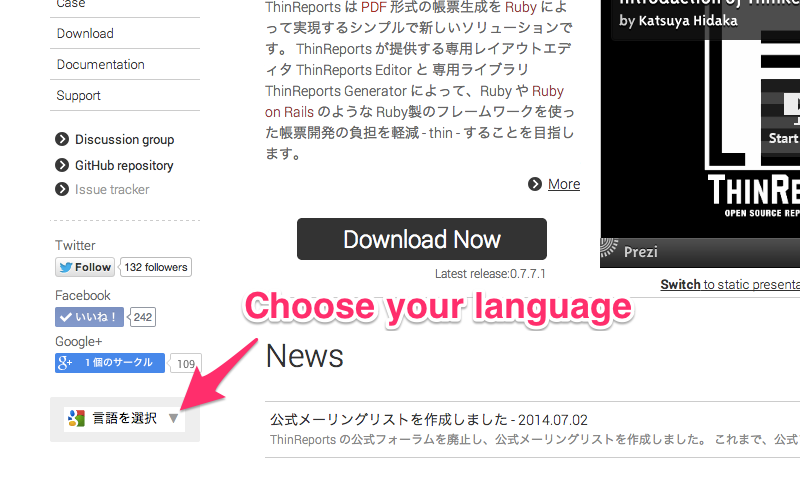

公式サイト www.thinreports.org の利用者のうち、約 30% が日本語以外の環境を使っています。
この状況に対応するために [Google ウェブサイト翻訳ツール](https://translate.google.com/manager/website/) を設置しました。

以下のように、自分の言語を選択することでサイト全体が Google 翻訳によって自動的に翻訳されます。

ぜひご活用下さい。また、よろしければ翻訳改善にご協力ください。
