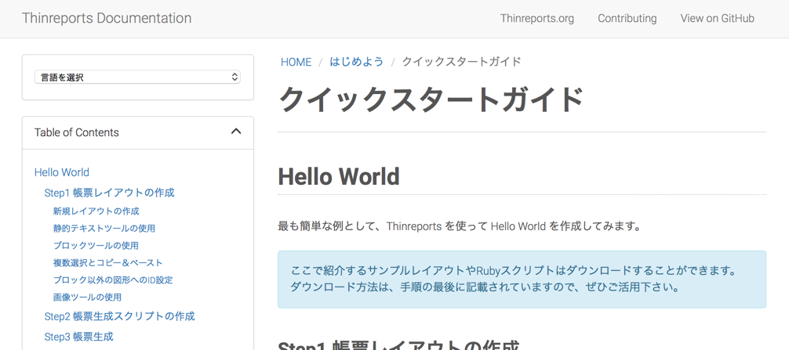

2つお知らせがあります。

### ドキュメントページのリニューアルと引越し

これまで Thinreports のドキュメントは [osc.matsukei.net](http://osc.matsukei.net/projects/thinreports/wiki) で
公開していましたが、リニューアルととも [thinreports.org/documentation](http://www.thinreports.org/documentation/) へ引越ししました。

新ドキュメントページの特徴は下記の通りです:

  * GitHub Pages + Jekyll で作成
  * GitHub リポジトリは [github.com/thinreports/documentation](https://github.com/thinreports/documentation) です
  * 他言語対応は Google Translate を使っています。**翻訳結果の改善にご協力ください**（詳細は [こちら](https://github.com/thinreports/documentation#contributing-to-thinreports-documentation)）
  * 間違いの報告や提案、Pull Request も上記 GitHub よりお願いします
  * 貢献方法の詳細は [README](https://github.com/thinreports/documentation#contributing-to-thinreports-documentation) をご覧ください

なお、これによって、旧プロジェクト [osc.matsukei.net](http://osc.matsukei.net/projects/thinreports)
のほぼすべての情報の移行が完了したことになるため、近い将来 [osc.matsukei.net](http://osc.matsukei.net/projects/thinreports) は閉鎖されます。下記に対応表を掲載しておきます。

|      | 今    | 昔     |
| ---- | :---- | :---- |
| Issues | [Editor(GitHub)](https://github.com/thinreports/thinreports-editor/issues) / [Generator(GitHub)](https://github.com/thinreports/thinreports-generator/issues) | [osc.matsukei.net](http://osc.matsukei.net/projects/thinreports/issues) |
| Discussion Group | [Google Groups](https://groups.google.com/forum/#!forum/thinreports) | [osc.matsukei.net](http://osc.matsukei.net/projects/thinreports/boards) |
| Documentation | [thinreports.org/documentation](http://www.thinreports.org/documentation) | [osc.matsukei.net](http://osc.matsukei.net/projects/thinreports/wiki) |
| Examples | [GitHub](https://github.com/thinreports/thinreports-examples) | [osc.matsukei.net](http://osc.matsukei.net/projects/thinreports/issues) |

### コントリビュートガイドの公開

新ドキュメントの間違い報告や Editor と Generator の開発への貢献など、
Thinreports へのコントリビュートガイドを
[thinreports/thinreports](https://github.com/thinreports/thinreports) の
[Wiki](https://github.com/thinreports/thinreports/wiki/How-to%3A-Contributing-to-Thinreports) にまとめました。

また、Editor や Generator の開発環境を構築する手順など、
これまで不足していた開発に参加するために必要な手順や情報についても順次掲載していきますので、
Thinreports へのコントリビュートをお待ちしています。
