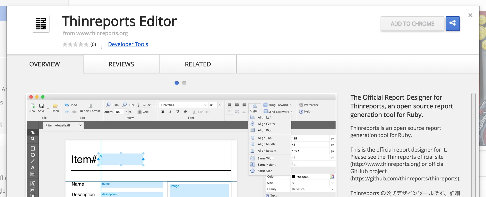

Thinreports 0.8.0 をリリースしました。

このリリースには主に以下の変更が含まれています。

  * Editor が Chrome アプリへ
  * Generator の非推奨 API が削除され、多くの API が非推奨へ
  * Generator にいくつかの新しい API が追加

いずれにも、大きな新機能はありませんが、次期メジャーバージョン 1.0.0 へ向けた大きな変更が含まれています。
詳細は **Changelog: [Editor](https://github.com/thinreports/thinreports-editor/blob/master/doc/CHANGELOG.md)
/ [Generator](https://github.com/thinreports/thinreports-generator/blob/master/CHANGELOG.md)** を参照してください。

いくつかの変更について簡単に説明しておきます。

### Editor - Chrome アプリ版をリリース

バージョン 0.8 より、Editor は Chrome アプリとしてリリースされます。
従来のインストーラ版も Windows のみリリースしていますが、次期メジャーリリースでは一切リリースされません。
特に理由がなければ Chrome アプリ版を使うことを強くお勧めします。Chrome アプリ版は [Chrome Web Store](<%= site_related_url['chrome_web_store'] %>) よりインストールできます。

### Generator - Ruby 1.8.7 のサポートを終了

PDF ライブラリ [Prawn](https://github.com/prawnpdf/prawn) を 1.3 へアップグレードしたことにより、
Ruby 1.8.7 がサポート対象外となりました。さらに、バージョン 1.0.0 より Ruby 1.9.3 をサポートしない予定です。

### 関連リンク

  * [Download](/download/)
  * [Installation Guide](/documentation/ja/getting-started/installation.html)
