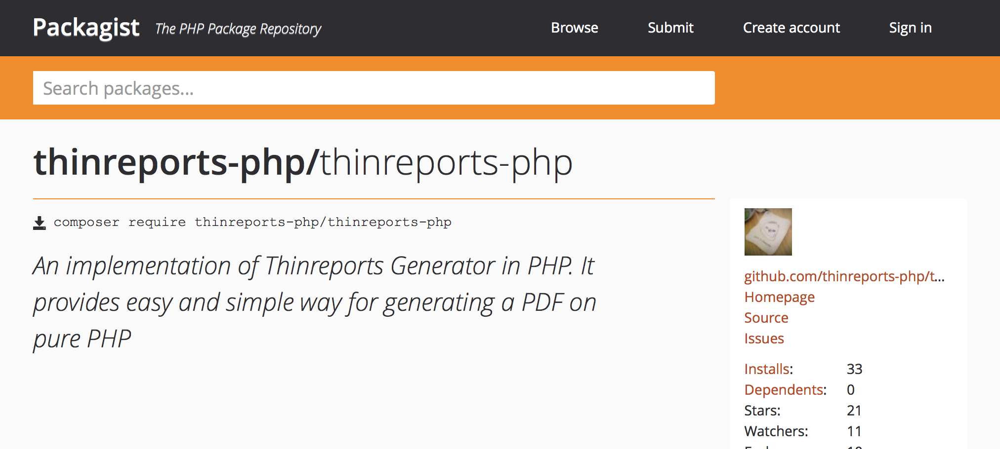

Thinreports Generator の PHP 実装である [Thinreports for PHP](https://github.com/thinreports-php/thinreports-php) の最初の安定版 v0.8.0 がリリースされました。alpha1, alpha2 を経てのリリースとなります。

alpha2 に対して1つのバグ修正と2つの新機能が追加されています。詳細は [リリースアナウンス](https://github.com/thinreports-php/thinreports-php/releases/tag/0.8.0) をご覧ください。

### 関連リンク

  * [0.8.0 リリースアナウンス](https://github.com/thinreports-php/thinreports-php/releases/tag/0.8.0)
  * [Getting Started](https://github.com/thinreports-php/thinreports-php#getting-started)
  * [Quick Reference (WIP)](https://github.com/thinreports-php/thinreports-php/wiki/Quick-Reference)
