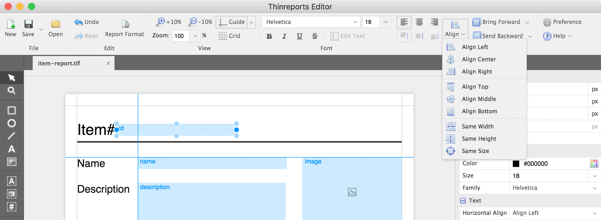

Thinreports Editor 0.10.0 をリリースしました。

Chromeアプリケーション終了に伴い、 [Electron](https://electron.atom.io/) ベースのデスクトップアプリケーションへの移行を行いました。機能の追加・変更はありません。

  * Released as an Electron based application
  * Drop support for layout created/modified with Editor 0.8.0

### Released as an Electron based application

Electron ベースのデスクトップアプリケーションとしてリリースしました。以下の OS をサポートします。
括弧内の数字はテスト済みのバージョンです。

  * macOS (10.12)
  * Ubuntu (16.04)
  * Windows (10)

インストール手順は [インストールガイド](http://www.thinreports.org/documentation/ja/getting-started/installation.html) をご覧ください。

なお、今後 Chromeアプリケーション版のリリースはありません。
Chromeアプリケーション版(0.9.0)を使いたい場合は [インストールガイド](http://www.thinreports.org/documentation/ja/getting-started/installation.html) を確認してください。

### Drop support for layout created/modified with Editor 0.8.0

0.10.0 より、0.8.0 の Editor で作成/修正されたレイアウトファイルをサポートしません。
0.8.0 のレイアウトファイルを開きたい場合は、Editor 0.9.0 で保存し直すか、
[thinreports-cli(Unofficial)](https://github.com/hidakatsuya/thinreports-cli) を使って 0.9.0 形式に変換することができます。

### References

 - [CHANGELOG](https://github.com/thinreports/thinreports-editor/blob/master/CHANGELOG.md)
 - [Installation Guide](http://www.thinreports.org/documentation/en/getting-started/installation.html)
